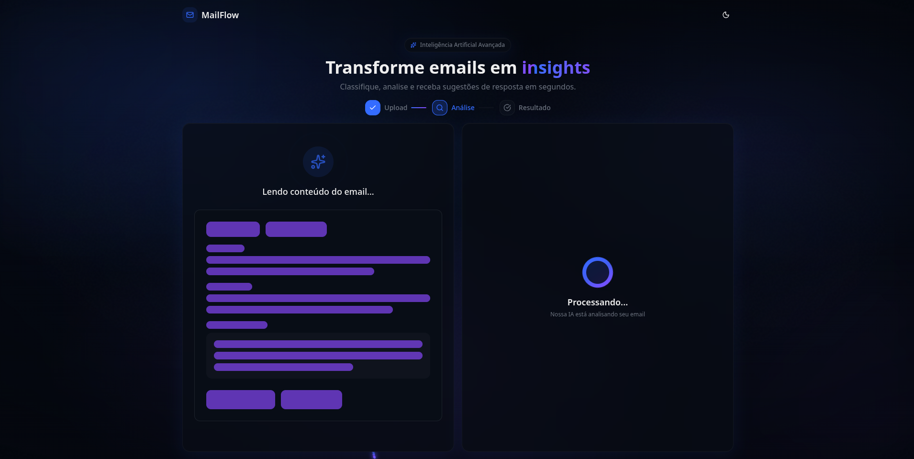

# MailFlow 📧

Sistema inteligente de triagem e análise de emails. Utiliza IA (Google Gemini) para classificar, priorizar e gerar respostas automáticas para emails, com uma interface moderna e intuitiva.


## 🏗 Arquitetura

O projeto é dividido em dois módulos principais:

- **Backend (`/backend`):** API FastAPI com integração Gemini AI.
- **Frontend (`/frontend`):** Interface React/Vite com design system customizado.

## 🚀 Como Rodar

### 1. Backend

```bash
cd backend
python -m venv venv
source venv/bin/activate
pip install -r requirements.txt

# Configure o .env (veja .env.example)

uvicorn app.main:app --reload
```

### 2. Frontend

```bash
cd frontend
pnpm install
pnpm dev
```

Acesse a aplicação em `http://localhost:3000`.

## 📸 Screenshots

### Fluxo de Análise


### Resultado (Neon Badges)

