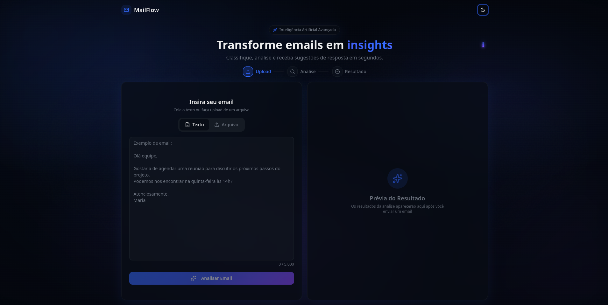

<p align="center">
    <a href="#-projeto">🖥 Projeto</a>&nbsp;&nbsp;&nbsp;|&nbsp;&nbsp;&nbsp;
    <a href="#-tecnologias">👨‍💻 Tecnologias</a>&nbsp;&nbsp;&nbsp;|&nbsp;&nbsp;&nbsp;
    <a href="#-executar-o-projeto">🖇 Execução do Projeto</a>&nbsp;&nbsp;&nbsp;|&nbsp;&nbsp;&nbsp;
    <a href="#-licença">📃 Licença</a>&nbsp;&nbsp;&nbsp;|&nbsp;&nbsp;&nbsp;
    <a href="#-observações">📌 Observações</a>
</p>

<div style="display: flex; flex-direction: row; justify-content: center; align-items: center; flex-wrap: wrap" align="center">
    
</div>

## 🖥 Projeto

O **MailFlow** é um sistema inteligente de triagem de emails. Ele utiliza Inteligência Artificial (Google Gemini) para analisar, categorizar (Produtivo/Improdutivo), definir prioridade e sugerir respostas automáticas para emails recebidos. O projeto conta com um backend robusto em Python e um frontend moderno e responsivo.

## 👨‍💻 Tecnologias

As principais tecnologias usadas nesse projeto foram:

**Backend**
- [FastAPI](https://fastapi.tiangolo.com/)
- [Google Gemini AI](https://ai.google.dev/)
- [NLTK](https://www.nltk.org/)
- [PyMuPDF](https://pymupdf.readthedocs.io/)

**Frontend**
- [Vite](https://vitejs.dev/)
- [React](https://reactjs.org/)
- [TypeScript](https://www.typescript.org/)
- [TailwindCSS](https://tailwindcss.com/)
- [Shadcn/ui](https://ui.shadcn.com/)

## 🖇 Executar o Projeto

Para executar o projeto completo, você precisará de dois terminais.

1. **Clone o repositório**
   ```bash
   git clone https://github.com/Yta-ux/mailflow.git
   cd mailflow
   ```

2. **Backend (Terminal 1)**
   ```bash
   cd backend
   python -m venv venv
   source venv/bin/activate  # Windows: venv\Scripts\activate
   pip install -r requirements.txt
   
   # Crie o arquivo .env com sua GEMINI_API_KEY (ver .env.example)
   
   uvicorn app.main:app --reload
   ```

3. **Frontend (Terminal 2)**
   ```bash
   cd frontend
   pnpm install
   pnpm dev
   ```

Acesse a aplicação em `http://localhost:3000`.

## 📃 Licença

Esse projeto possui licença MIT. Para mais detalhes consulte o arquivo [LICENSE](LICENSE).

## 📌 Observações

- O projeto é dividido em `backend` e `frontend`. Cada pasta possui seu próprio `README.md` com detalhes técnicos específicos de implementação.
- É necessário ter uma chave de API do Google Gemini para o funcionamento da IA.
- ⚠️ **Aviso de Infraestrutura:** A API está hospedada no serviço **Render (Free Tier)**. Por isso, a primeira requisição pode levar até **50 segundos** para acordar o servidor. As requisições subsequentes são rápidas.
