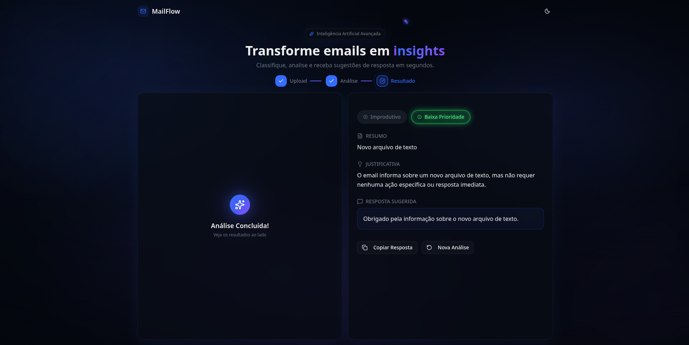

# MailFlow Frontend

Interface moderna e responsiva para o sistema de triagem de emails MailFlow. Construída com foco em UX, performance e um design "Neon" marcante.

## 🛠 Stack

- **Core:** React + Vite + TypeScript
- **Estilização:** TailwindCSS + Shadcn/ui
- **Ícones:** Lucide React
- **HTTP Client:** Axios

## 🚀 Setup

Certifique-se de estar na pasta `frontend`:

```bash
# Instalar dependências
pnpm install

# Rodar em desenvolvimento
pnpm dev
```

Acesse `http://localhost:3000`.

## 📸 Preview

Aqui você pode ver o fluxo de análise e o resultado com as badges neon.


